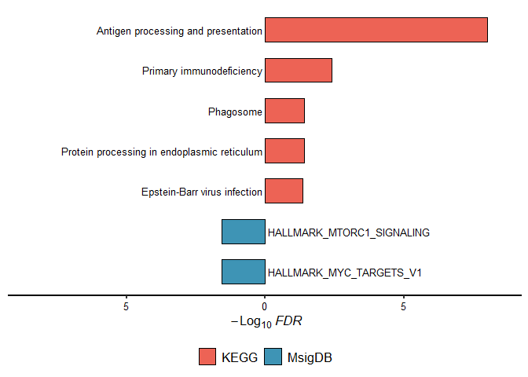
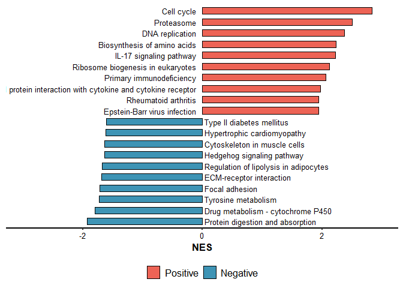

<!-- README.md is generated from README.Rmd. Please edit that file -->

# simpleEnrichr

<!-- badges: start -->
<!-- badges: end -->

simpleEnrichr is package run simple enrichment analysis

## Installation

You can install the development version of simpleEnrichr from
[Github](https://github.com/Moonerss/simpleEnrichr) with:

``` r
install.packages('remotes')
remotes::install_github('Moonerss/simpleEnrichr')
```

## Usage

### Over-representative analysis

``` r
library(simpleEnrichr)
#> 
#> 
#> ##############################################################################
#> Pathview is an open source software package distributed under GNU General
#> Public License version 3 (GPLv3). Details of GPLv3 is available at
#> http://www.gnu.org/licenses/gpl-3.0.html. Particullary, users are required to
#> formally cite the original Pathview paper (not just mention it) in publications
#> or products. For details, do citation("pathview") within R.
#> 
#> The pathview downloads and uses KEGG data. Non-academic uses may require a KEGG
#> license agreement (details at http://www.kegg.jp/kegg/legal.html).
#> ##############################################################################
```

``` r
genes <- c("CANX", "HSPA1B", "KLRC2", "PSMC6", "RFXAP", "TAP1")
res <- simple_ORA(genes, enrich.type = "KEGG")
#> ℹ Updating gene symbols...
#> Maps last updated on: Fri May 17 15:09:37 2024
#> ℹ Transforming "SYMBOL" to ENTREZID...
#> 'select()' returned 1:1 mapping between keys and columns
#> ℹ Performing KEGG enrichment...
#> ℹ 5 significant terms were detected...
#> ✔ Done!
```

run ORA enrichment analysis one time!!!

``` r
res_all <- ORA_intergated(genes, enrich.type = c("KEGG", "MsigDB"))
#> ℹ Updating gene symbols...
#> Maps last updated on: Fri May 17 15:09:37 2024
#> ℹ Transforming "SYMBOL" to ENTREZID...
#> 'select()' returned 1:1 mapping between keys and columns
#> ℹ Performing KEGG enrichment...
#> ℹ 5 significant terms were detected...
#> ✔ Done!
#> ℹ Updating gene symbols...
#> Maps last updated on: Fri May 17 15:09:37 2024
#> ℹ Transforming "SYMBOL" to ENTREZID...
#> 'select()' returned 1:1 mapping between keys and columns
#> ℹ Performing MsigDB-"H" enrichment...
#> ℹ 2 significant terms were detected...
#> ✔ Done!
#> ℹ Final statistics ...
#> ℹ 7 significant terms were detected...
#> ✔ Done!
names(res_all)
#> [1] "KEGG"   "MsigDB"
```

### Gene set enrichment analysis

``` r
data(geneList, package="DOSE")

fit <- simple_GSEA(geneList, enrich.type = "KEGG", gene.type = "ENTREZID")
#> ℹ Performing KEGG enrichment...
#> ℹ 55 significant terms were detected..
#> ✔ Done!
```

run GSEA enrichment analysis one time!!!

``` r
fit_all <- GSEA_intergated(geneList, gene.type = 'ENTREZID', enrich.type = c("MsigDB", "KEGG"))
#> ℹ Performing MsigDB-"H" enrichment...
#> ℹ 28 significant terms were detected..
#> ✔ Done!
#> ℹ Performing KEGG enrichment...
#> ℹ 55 significant terms were detected..
#> ✔ Done!
#> ℹ Final statistics ...
#> ℹ 83 significant terms were detected...
#> ✔ Done!
names(fit_all)
#> [1] "MsigDB" "KEGG"
```

### Visualization

``` r
ORA_dotplot(res)
```


``` r
GSEA_dotplot(fit)
```


``` r
GSEA_rankplot(fit, Pathway.ID = 'hsa04110')
```


``` r
ORA_two_barplot(res_all$KEGG, res_all$MsigDB, Selct.P = 'FDR', obj.types = c("KEGG", "MsigDB"))
```



``` r
GSEA_two_barplot(fit, pos.top.pathway.num = 10, neg.top.pathway.num = 10)
```


